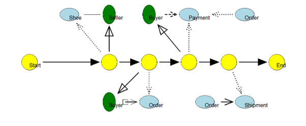
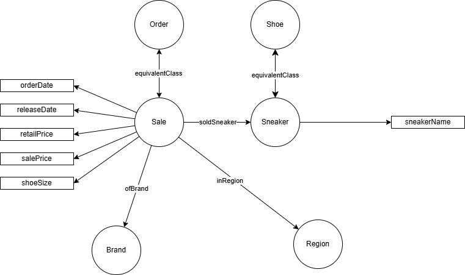

# SNEAKER-Reseller-KG
Query a Graph Data base using Natural Language

This document presents and explains to the reader how the knowledge graph was created, showing clear instructions on how to recreate the process. It also provides a detailed description of the files and scripts created and used during the process.

## Steps to Reproduce the Creation of the Knowledge Graph

The data for the knowledge graph is fetched from 4 different sources: legacy data that is refined using OntoText refine, a metamodel and a model, created using ADOxx, manual RDF statements that connect these 2 data sources and lastly, OWL axioms, RDFS and SPARQL insert rules are defined to demonstrate and create reasoning results.

### 1. Refine and Import Legacy Data

The detailed steps of this part are presented in the /doc/... document.

The resulting turtle (.ttl) file (`refine_full.ttl`) contains RDF properties and about 100000 instances of sneakers, orders, regions, brands and their properties.

Every instance of a class or property contains the `http://sneakerproject.org#` namespace, however, it could be replaced by the default notation ':'. For this, the models/fix-namespaces.py python script has been used, that replaces each explicit use of the URL with ':' (see code below). The output file is named `clean_refine_full.ttl`.

```python
INPUT_FILE = "refine_full.ttl"
OUTPUT_FILE = "clean_refine_full.ttl"

g = Graph()
g.parse(INPUT_FILE, format="turtle")

g.bind("", "http://sneakerproject.org#")

g.serialize(
    destination=OUTPUT_FILE,
    format="turtle"
)
```

The created clean_refine_full.ttl file then is imported into the GraphDB repository.

The properties are not defined using OWL syntax, as well as the classes are not declared explicitly, therefore, for the knowledge graph these have to be done manually. For this another turtle file is created with the classes and properties that are incorrectly defined. This can be performed after importing the modelling part (ADOxx).

To analyze and fetch the missing classes and properties the following queries are used:

1. Get all classes:

```sparql
PREFIX owl: <http://www.w3.org/2002/07/owl#>
SELECT DISTINCT ?s
WHERE { ?s a owl:Class }
```

This will display all the defined OWL classes. If the imported classes do not appear here, they have to be added manually in another file.

2. Get undefined but used classes:

```sparql
PREFIX rdf: <http://www.w3.org/1999/02/22-rdf-syntax-ns#>
SELECT DISTINCT ?class
WHERE {
    ?instance rdf:type ?class .
    FILTER(STRSTARTS(STR(?class), "http://sneakerproject.org#"))
}
ORDER BY ?class
```

Create a list with all the classes that are undefined. This list is used to create the file for defining them.

3. Get undefined but used object properties:

```sparql
SELECT DISTINCT ?property
WHERE {
    ?s ?property ?o .
    FILTER(isIRI(?o))
    FILTER(STRSTARTS(STR(?property), "http://sneakerproject.org#"))
}
ORDER BY ?property
```

4. Get undefined but used datatype properties:

```sparql
SELECT DISTINCT ?property
WHERE {
    ?s ?property ?o .
    FILTER(isLiteral(?o))
    FILTER(STRSTARTS(STR(?property), "http://sneakerproject.org#"))
}
ORDER BY ?property
```

The above 2 queries are used to fetch all the properties that have to be defined using owl:ObjectProperty, respctively owl:DatatypeProperty.

5. Get OWL properties without the RDF properties:

After the classes and properties are clearly defined, the newly defined properties can be checked using the following query:

```sparql
PREFIX owl: <http://www.w3.org/2002/07/owl#>
SELECT ?p
       (SAMPLE(?t) AS ?type)
WHERE {
  ?p a ?t .
  FILTER(?t IN (owl:ObjectProperty, owl:DatatypeProperty))
}
GROUP BY ?p
```

### 2. Importing the ADOxx Model

The detailed steps on how the ADOxx metamodel and then the model were created, can be found in the `doc/Steps to recreate the ADOxx models` document.

The resulting model was exported in XML format and then converted to Turtle syntax (.ttl file - `sneaker-model.ttl`). This can be imported into GraphDB, defining the ontology of the database.

The resulting model is presented on the diagram below:



For details about the notation, classes and properties, inspect the `doc/Steps to recreate the ADOxx models` document.

### 3. Manual RDF Content

The first manually added RDF content consists of semantic mappings between concepts originating from different data sources. In particular, equivalence relationships are defined between the `:Shoe` class from the ADOxx model and the `:Sneaker` class imported from the legacy dataset, as well as between the `:Order` class from the ADOxx model and the `:Sale` class from the legacy dataset. These mappings enable GraphDB to treat equivalent concepts from different sources as representing the same real-world entities.

These definitions are contained in the `/models/additional_classes.ttl` file.

- Class definitions

```turtle
:Sale
    a owl:Class ;
    rdfs:subClassOf :BusinessEntity ;
    owl:equivalentClass :Order .

:Sneaker
    a owl:Class ;
    rdfs:subClassOf :BusinessEntity ;
    owl:equivalentClass :Shoe .
```

- Object properties

```turtle
:inRegion
    a owl:ObjectProperty ;
    rdfs:domain :Sale ;
    rdfs:range :Region .

:ofBrand
    a owl:ObjectProperty ;
    rdfs:domain :Sale ;
    rdfs:range :Brand .

:soldSneaker
    a owl:ObjectProperty ;
    rdfs:domain :Sale ;
    rdfs:range :Sneaker .
```

- Datatype properties

```turtle
:orderDate
    a owl:DatatypeProperty ;
    rdfs:domain :Sale ;
    rdfs:range xsd:date .

:releaseDate
    a owl:DatatypeProperty ;
    rdfs:domain :Sale ;
    rdfs:range xsd:date .

:salePrice
    a owl:DatatypeProperty ;
    rdfs:domain :Sale ;
    rdfs:range xsd:decimal .

:retailPrice
    a owl:DatatypeProperty ;
    rdfs:domain :Sale ;
    rdfs:range xsd:decimal .

:shoeSize
    a owl:DatatypeProperty ;
    rdfs:domain :Sale ;
    rdfs:range xsd:decimal .

:sneakerName
    a owl:DatatypeProperty ;
    rdfs:domain :Sneaker ;
    rdfs:range xsd:string .
```

In addition to the equivalence mappings, this Turtle file contains explicit OWL declarations for the classes and properties discovered in the imported legacy data (`/models/clean_refine_full.ttl`). Since the imported RDF data primarily contains instances and relationships, the corresponding ontology elements (OWL classes, object properties, and datatype properties) are manually defined to provide a complete ontology structure and to support reasoning within GraphDB.

The imported legacy data, together with the defined equivalent classes results in the ontology presented in the graph below:



The equivalence classes were added manually and all the other properties (object and datatype properties) are inserted from the legacy data.

#### Data enrichment using LLMs

To enrich and validate the knowledge graph structure, a limited set of synthetic instances for Buyers, Sellers, Payments, and Shipments was generated using Large Language Models. These instances are used as controlled test data to demonstrate how the defined classes and properties interact within the knowledge graph.

The generated instances are stored in `models/instances.ttl` and serve as supporting data for evaluating and demonstrating the reasoning rules described in Chapter 4

### 4. Reasoning Rules

There are reasoning rules implemented to enrich the knowledge graph, including OWL axioms, RDFS semantics and SPARQL insert rules. The objective of these rules is to derive implicit knowledge from explicitly stored data.

#### 4.1. OWL Axioms (Schema-Level Reasoning)

OWL axioms are used to define semantic relationships between properties, for instance enabling automatic inference of inverse relations.

```sparql
@prefix : <http://sneakerproject.org#> .
@prefix owl: <http://www.w3.org/2002/07/owl#> .

:soldBy owl:inverseOf :soldSale .
:placedBy owl:inverseOf :places .
:paidBy owl:inverseOf :pays .
```

Example:

If the graph contains `:seller_1 :soldSale :sale_1 .`, the reasoner can infer `:sale_1 :soldBy :seller_1 .`.

To test the effect of the rule above, the following query can be run:

```sparql
PREFIX : <http://sneakerproject.org#>

SELECT ?seller ?sale
WHERE {
  ?sale :soldBy ?seller .
}
```

#### 4.2. RDFS Reasoning

RDFS is used for class and hierarchy inference.

__Example: Domain and range inference:__

If the following statement exists `:buyer_1 :places :order_1 .` and the ontology defines:

```sparql
:places rdfs:domain :Buyer ;
        rdfs:range :Order .
```
then GraphDB infers automatically:

```sparql
:buyer_1 a :Buyer .
:order_1 a :Order .
```

This ensures missing type declarations are automatically completed.

#### 4.3. SPARQL Rule-Based Reasoning

SPARQL rules are used to compute derived attributes that cannot be expressed in OWL.

The following rule is defined for the knowledge graph:

The profit is defined as the sale price minus the retail price. This is defined by the following query:

```sparql
PREFIX : <http://sneakerproject.org#>

INSERT {
  ?sale :profit ?p .
}
WHERE {
  ?sale :salePrice ?sp ;
        :retailPrice ?rp .
  BIND(?sp - ?rp AS ?p)
}
```

and it can be tested using:

```sparql
PREFIX : <http://sneakerproject.org#>

SELECT ?sale ?sp ?rp ?profit
WHERE {
  ?sale :salePrice ?sp ;
        :retailPrice ?rp ;
        :profit ?profit .
}
LIMIT 20
```

## Frontend Application

Chat page (`index.html` + `style.css` + `app.js`) for the graph: direct SPARQL queries or the TTYG agents.

- Run `python server.py`, then open <http://localhost:5500>.
- `server.py` serves the page and proxies `/repositories` + `/rest` to GraphDB on port 7200, so no CORS setup is needed.
- Agent ids: open <http://localhost:7200/rest/chat/agents> — copy the `id` values into `app.js`.
- Full guide (setup from scratch, demo script, troubleshooting): see [TUTORIAL.md](TUTORIAL.md).

## Weaviate Vector Database Integration

A Weaviate vector database is integrated into the project, storing local knowledge graph embeddings. The details description of this component is found in the `Tutorial_Weaviate_Gemini_GraphDB-1` file.